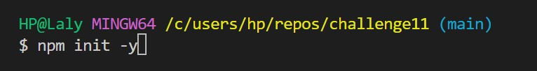
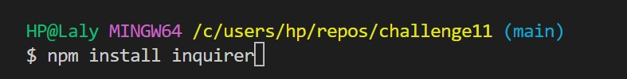
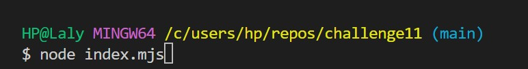
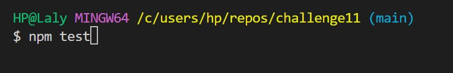
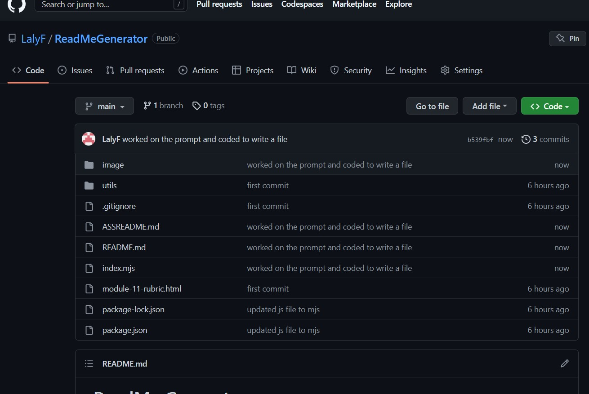

# ReadMe Generator
This is a Node.js command-line application that generates a high-quality README.md file based on the user's input. This application is designed to save time and effort when creating README.md files for your projects.

## Table of Contents

+ Installation
+ Usage
+ License
+ Contributing
+ Tests
+ Questions

## Installation

To create a Node.js project

To install the necessary dependencies here it is inquirer, run the following command:

## Usage
To run the application, use the following command:

The application will then prompt you to answer a series of questions about your project. Once you have answered all of the questions, the application will generate a README.md file in the current directory.

## WalkThrough
This video is a walkthrough to the project and the final output

## License
This project is licensed under the MIT license.

## Contributing
Contributions to this project are welcome. If you would like to contribute, please fork the repository and submit a pull request.

## Tests
To run the tests, use the following command:

## URL

GitHub url: [https://github.com/LalyF/ReadMeGenerator.git]

## Questions
If you have any questions about the project, please feel free to contact me at lalymanaf2015@gmail.com. You can find more of my work at LalyF.

